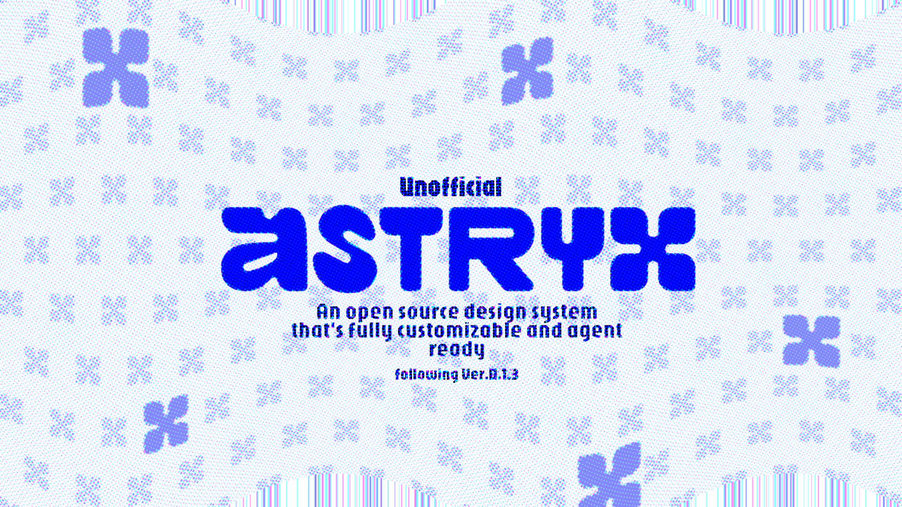

# Astryx Design System Figma Mirror

This repository maintains a source-backed Figma mirror of the official Astryx design system. The goal is exact public API, component, example, asset, token, and state fidelity—not a visually similar reinterpretation.



## Status

<!-- AUTOMATION:STATUS:START -->
- Verified baseline: **Astryx v0.1.6** with exact core/CLI versions.
- Official inventory: 149 components, 43 page templates, 584 block templates.
- Figma integrity: 81 pages, 2,885 components (763 Astryx mirror + 2,122 user-provided Material icons), 91 component sets, 0 broken instances.
- Automation efficiency/semantic v2: 19 tests passing.
- Current state and risks live in `checkpoint.md`; team-library publishing remains manual.
<!-- AUTOMATION:STATUS:END -->

## Figma

[Astryx Design System on Figma Community](https://www.figma.com/community/file/1655939158795671259)

## Start Here

Agents and maintainers follow the same entry flow:

1. Read `checkpoint.md` for the current verified baseline, risks, and immediate work.
2. Read only the routing section at the top of `advise.md`.
3. Load the focused protocol files routed for the current task.
4. For automated Figma work, follow `automation/prompts/coordinator.md`.
5. Do not load all historical logs or the full `advise.md` unless an unresolved edge case requires them.

## Document Roles

### `AGENTS.md`

Codex and general coding-agent entry instructions. It contains the non-negotiable Astryx CLI/token rules and routes Figma work into the new protocol and automation workflow.

### `.claude/CLAUDE.md`

Claude-specific entry instructions. It mirrors the same routing, scoped snapshot, semantic verification, and publishing boundaries as `AGENTS.md`. There is no separate root-level `CLAUDE.md`.

### `advise.md`

A compact routing section followed by retained historical/reference guidance. Agents read the routing section first and only open deeper legacy sections for unresolved edge cases.

### `automation/protocols/`

Focused instructions loaded by task type:

- `run-efficiency.md` — cache, scope, compact result, and budget rules
- `source-resolution.md` — official source precedence and cache invalidation
- `component-production.md` — variants, properties, slots, lineage, and writes
- `visual-assets.md` — images, crop/fit, staged screenshots, and hash reuse
- `publishing.md` — manual publish and consumer smoke lifecycle

### `checkpoint.md`

Short current-state handoff only: verified baseline, active risks, immediate next work, and links to detailed logs.

### `logs/`

Dated audits, source comparisons, verification evidence, failures, and historical details. These are not loaded by default.

### `automation/`

The hash-bound control plane: cached source evidence, scoped Figma snapshots, semantic diff/contracts, deterministic plans, approval validation, constrained editing, independent verification, visual reuse, efficiency measurement, and publishing readiness.

## Source Rules

- Discover with `npx astryx search`, `component`, and `template`; do not guess.
- CLI component/template output is definitive for public API and example code.
- Use package source when the cached contract lacks runtime anatomy, state, or geometry.
- Use rendered docs/MCP for visible coverage, guidance, or a recorded conflict.
- Existing Figma art is never proof of the official source.
- Bind tokenable colors, spacing, radius, typography, and elevation to Astryx variables.
- Preserve source-defined intrinsic media sizes and explicit rgba/gradient values only when no Astryx token represents them.

## Automation v2 Workflow

### 1. Initialize and reuse official evidence

```powershell
npm run library:state -- init --run automation/runs/<run-id>
npm run library:collect -- --run <run-id>
```

`library:collect` fingerprints the exact core package, CLI binary, lockfile, and collection mode. When unchanged, it performs no component/template detail calls and writes a small hash-bound `official.json` reference to the run.

Raster source bytes are stored once by SHA-256 under the ignored `automation/cache/` store.

### 2. Plan a target/dependency read scope

```powershell
npm run library:plan-read-scope -- `
  --figma <verified-baseline.json> `
  --components Selector,MultiSelector `
  --run automation/runs/<run-id>
```

The Figma reader collects only the target pages, dependent-instance pages, and required foundations described by `read-scope.json`.

Full 81-page reads are reserved for:

- Astryx source-version changes
- foundation changes
- public component identity changes
- bulk multi-page operations
- publish readiness
- scheduled full audits

### 3. Merge the scoped read with the verified baseline

```powershell
npm run library:normalize-figma -- `
  --input <scoped-figma-read.json> `
  --baseline <verified-baseline.json> `
  --scope Selector `
  --output automation/runs/<run-id>/figma-before.json
```

Normalization emits per-page hashes, a foundation hash, and a Merkle root. Approval binds to that root instead of repeatedly serializing an unchanged full snapshot.

### 4. Diff, plan, and preflight

```powershell
npm run library:diff -- `
  --official automation/runs/<run-id>/official.json `
  --figma automation/runs/<run-id>/figma-before.json `
  --semantic-scope Selector,MultiSelector `
  --run automation/runs/<run-id>

npm run library:plan -- `
  --diff automation/runs/<run-id>/diff.json `
  --run automation/runs/<run-id>

npm run library:validate-capabilities -- `
  --plan automation/runs/<run-id>/plan.json

npm run library:plan-screenshots -- `
  --plan automation/runs/<run-id>/plan.json `
  --run automation/runs/<run-id>
```

Capability preflight blocks known invalid Figma mechanics before approval, including variant-specific defaults for one exposed nested INSTANCE_SWAP, manual coordinates controlled by Auto Layout, and rotated substitute icons.

### 5. Approve and validate exact scope

```powershell
npm run library:approve -- `
  --run automation/runs/<run-id> `
  --approver <name> `
  --operations all

npm run library:validate -- `
  --run automation/runs/<run-id> `
  --figma-before automation/runs/<run-id>/figma-before.json
```

High-risk operations require explicit `--ack-high-risk` IDs. Bulk plans additionally require `--ack-bulk <planHash>`. Approval never authorizes newly discovered work.

### 6. Execute one component-set transaction

The MCP editor executes only validated operation IDs. One approved public component set and its complete variant matrix are treated as one transaction.

Operation results use compact root-level summaries:

- mutated/created roots
- descendant counts
- result digest
- typed assertions and warnings
- leaf IDs only when required for rollback or targeted diagnosis

### 7. Verify in cost order

After a separate scoped readback and baseline merge:

```powershell
npm run library:verify-semantics -- `
  --figma automation/runs/<run-id>/figma-after.json `
  --scope Selector,MultiSelector `
  --run automation/runs/<run-id>
```

Verification order is fixed:

1. structural integrity
2. semantic contract coverage
3. screenshot/hash comparison

If structure or semantics fail, screenshot work stops. Visual verification captures containing frames first, reuses byte-identical screenshot hashes, and queues only changed or ambiguous images for model review.

```powershell
npm run library:visual-manifest -- --dir <screenshot-dir> --output <manifest.json>
npm run library:visual-diff -- `
  --baseline <verified-visual-manifest.json> `
  --current <manifest.json> `
  --run automation/runs/<run-id>

npm run library:verify -- --run automation/runs/<run-id>
```

Missing semantic evidence is failure. Legacy snapshots remain readable as historical evidence but must be recollected with reader-v2 fields when their pages are touched.

### 8. Measure and report

```powershell
npm run library:measure -- --run automation/runs/<run-id>
npm run library:report -- --run automation/runs/<run-id>
```

`efficiency.json` records cache hits, artifact references/bytes, scoped/full modes, Figma read/write calls, screenshots captured/reused, elapsed time, and budget warnings.

### 9. Publish manually and verify a consumer

Local verification and downstream delivery are separate states:

```text
VERIFIED
→ READY_TO_PUBLISH
→ PUBLISHED_MANUALLY
→ CONSUMER_SMOKE_VERIFIED
```

Publish readiness requires a complete full snapshot, release notes, stable public keys, publish-status coverage, zero broken instances, and zero active placeholders. A consumer file must then refresh the library, insert a new instance, update an existing instance, and confirm stale entries are gone.

Figma team-library publishing is never automated.

## Verification and Tests

```powershell
npm run library:test
npm run library:check-status
```

Current automation suite: 19 tests passing.

Detailed implementation record: `logs/2026-07-18-automation-efficiency-semantic-v2.md`.
